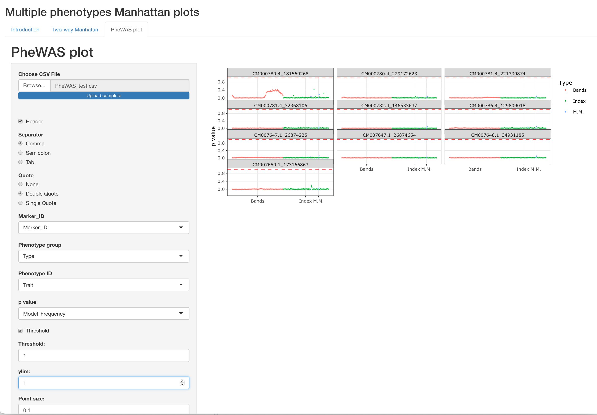

# Shiny app for multiple phenotypes Manhattan plots
This Shiny app allows the users to interpret multiple phenotype GWAS results interactively using Two-way Manhattan and PheWAS plots.

## Two-way Manhattan
The two-way Manhattan plot helps visualize GWAS results, where there are two factors of interest. For example, different traits and management conditions.
The interactive plots allow the user to identify candidate single nucleotide polymorphisms (SNPs) associated with several phenotypes along with additional information, such as p-value, chromosome, and genomic position.

### Usage
- The user must run the GWAS analysis externally using any software, such as GAPIT,rrBLUP, JWAS, etc...
- The user input can be a file separated by a comma, semicolon, or tab and specify quote
- The dataset is downloadable from the bottom of the app
- The dataset contains GWAS analysis of 13,826 SNPs for plant height (PH), stalk diameter (SD), and shoot dry mass (SDM) under two management conditions (B+ and B-)
- The user must identify the columns for Marker_ID, Marker position, posterior inclusion probability (PIP) or p value, chromosome, and factors 1 and 2 in the input that will be used for the plotting
- Changing the threshold, ylim, point size, and Y and X axes is possible
- Only a subset of 85% of the markers with PIP or p.value < 0.05 are plotted in order to save computing resources

## PheWAS plot
Interpreting GWAS analysis from hundreds to thousands of different phenotypes can be challenging. In this sense, PheWAS plots can efficiently help visualize the associations between SNPs and phenotypes.

### Usage
- The user must run the GWAS analysis externally using any software, such as GAPIT,rrBLUP, JWAS, etc...
- The user input can be a file separated by a comma, semicolon, or tab and specify quote
- The dataset is downloadable from the bottom of the app
- The dataset contains the summary of GWAS analysis for 281 hyperspectral phenotypes and three manually measured phenotypes (PH, SD, and SDM) for 10 SNPs
- The user must identify the columns for Marker_ID, phenotype group, phenotype ID (trait), and PIP or p value in the input that will be used for the plotting
- Changing the threshold, ylim, point size, number of columns, and Y and X axes is possible
              
## How to cite ShinyGWASPheWAS
Insert reference here

## Contact Information and support:
- Rafael Massahiro Yassue, <rafael.yassue@gmail.com>
