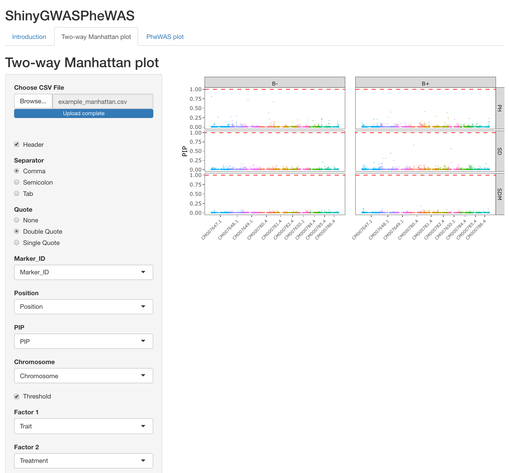

# Shiny app for multiple phenotypes Manhattan plots
This Shiny app allows the users to dynamic interpret multiple phenotype GWAS results using two types of interactive graphics

## Two-way Manhattan
The two-way Manhattan plot is helpful in visualizing GWAS results where there are two factors of interest, for example, different traits and management.
The interactive plots allow the user to identify candidate SNPs that may be associated with several phenotypes as any other important information from the GWAS analysis (p.value, chromosome, and genomic position)

### Guidelines
- The user must run the GWAS analysis externally using any software, such as GAPIT,rrBLUP, JWAS, etc...
- The user input can be a file separated by a comma, semicolon, or tab and specify quote
- In the left corner of the page is available for download an example file
- The example file cointain GWAS analysis of 13,826 single nucleotide polymorphisms (SNPs) for three traits (SDM, SD, PH) under two managements (B+ and B-)
- The user input must follow a similar structure from the example file. The oders of the columns may be different
- The user must identify the referring column of the Marker_ID, Marker position, p.value, chromosome, factor 1 and 2 in the input that will be used for the plot
- It is also possible to define the threshold, ylim, point size, Y and X axis labs

## PheWAS plot
Interpreting GWAS analysis from hundreds to thousands of different phenotypes can be challenging. In this sense, PheWAS plots can help to visualize the associations between SNPs and phenotypes and identify SNPs associated with several phenotypes

### Guidelines
- The user must run the GWAS analysis externally using any software, such as GAPIT,rrBLUP, JWAS, etc...
- The user input can be a file separated by a comma, semicolon, or tab and specify quote
- In the left corner of the page is available for download examples file.
- The example file contains the summary of GWAS analysis for 281 hyperspectral phenotypes and three manually measured for 10 SNPs. The phenotype_ID is the name of the phenotype and group is the class, if it is a reflectance, index, or manually measured phenotype
- The user input must follow a similar structure from the example file. The oders of the columns may be different
- The user must identify the referring column of the Marker_ID, phenotype group, phenotype ID (trait), and p.value
- It is also possible to define the threshold, ylim, point size, number of columns in the plots (Ncols), and Y and X axis labs

              
## How to cite ShinyGWASPheWAS
Insert reference here
## Contact Information and suport
- Rafael Massahiro Yassue, <rafael.yassue@gmail.com>
- Dr. Gota Morota, <morota@vt.edu>
              