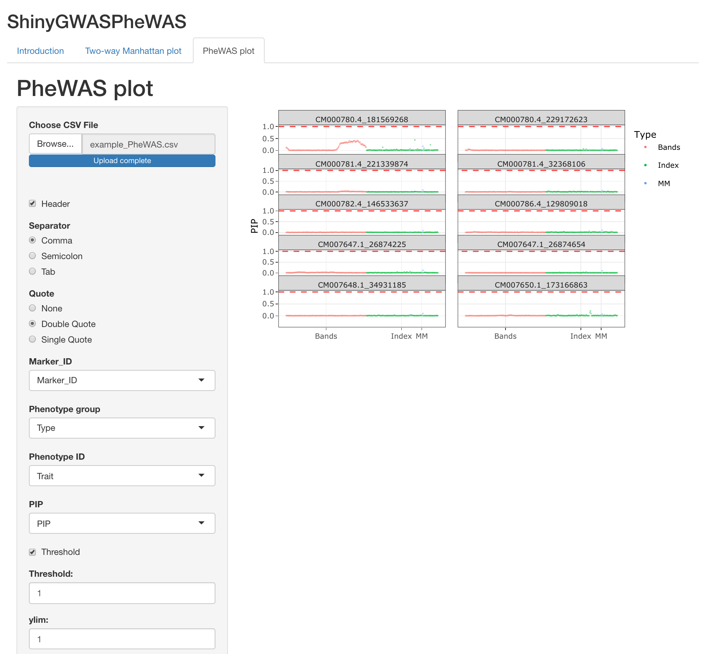

# Shiny app for multiple phenotypes Manhattan plots
This Shiny app allows the users to dynamic interpret multiple phenotype GWAS using two type of interactive graphics

## Two-way Manhattan
The two-way Manhattan plot is helpful in visualizing GWAS results where there are two factors of interest, for example, different traits and management.
The interactive plots allow the user to identify candidate SNPs that may be associated with several phenotypes as any other important information from the GWAS analysis (p.value, chromosome, and genomic position)

## PheWAS plot
Interpreting GWAS analysis from hundreds to thousands of different phenotypes can be challenging. In this sense, PheWAS plots can help to visualize the associations between SNPs and phenotypes and identify SNPs associated with several phenotypes

## Guidelines
- The user input can be a file separed by comma, semicolon or tab"),
- The user must identify the referring column of the Marker_ID, Marker position, p.value, chromosome, factor 1 and 2
- It is also possible to define the threshold, ylim, point size, Y and X axis labs
- For PheWAS plot, the user can also define the number of columns in the plots (Ncols)
- It is available for download examples files for two-ways Manhattan and PheWAS plot
              
## How to cite ShinyAIM
Insert reference here
## Contact Information and suport
- Rafael Massahiro Yassue, <rafael.yassue@gmail.com>
- Dr. Gota Morota, <morota@vt.edu>
              